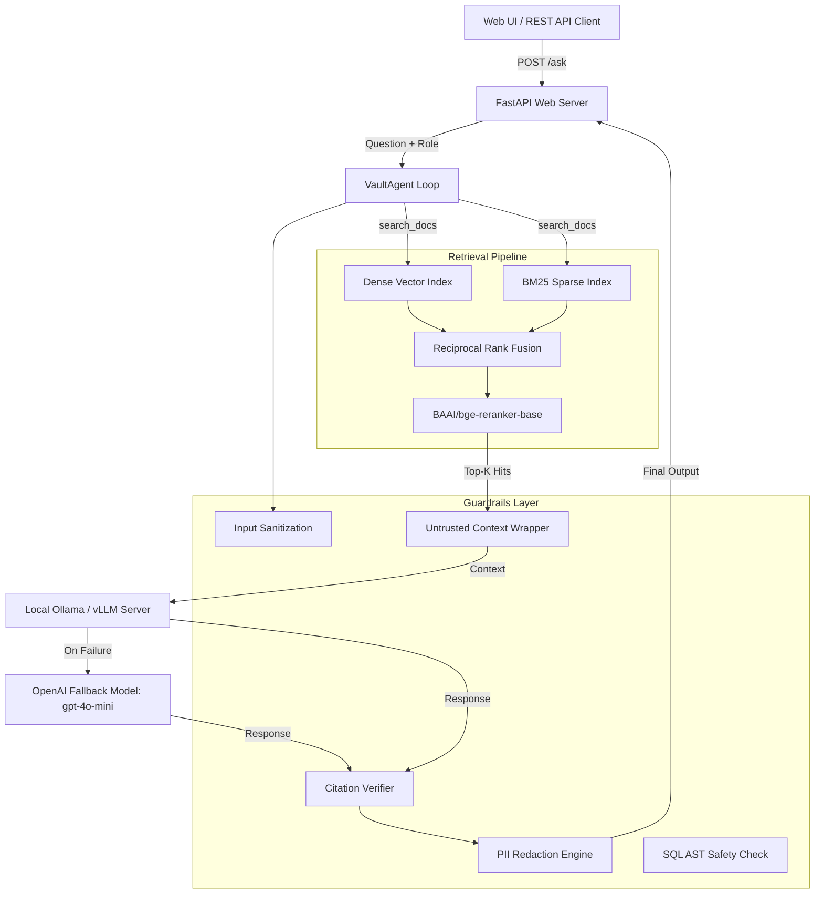

# Vault: Self-Hosted Enterprise Guardrailed RAG Stack

Vault is a fully self-hosted, enterprise-grade Retrieval-Augmented Generation (RAG) platform designed for private AI deployments with zero external runtime API dependencies. Built with Python 3.11, explicit modular architecture (no LangChain/LlamaIndex), role-based access control (RBAC), multi-stage hybrid retrieval with Cross-Encoder reranking, and hand-written agent guardrails (PII redaction, prompt injection defense, SQL AST safety via `sqlglot`, and low-confidence refusals), Vault guarantees that proprietary data remains 100% local and isolated.

## Architecture



---

## Quickstart

Spin up the entire stack (Qdrant, Postgres, Ollama server, automatic model downloader, and Vault API) locally:

```bash
docker compose up --build
```

Access the interactive web workspace at **`http://localhost:8000`** or perform health check:

```bash
curl http://localhost:8000/health
```

---

## Fully-Local & High-Availability Model Support

- **Primary Local LLM**: All embeddings (`BAAI/bge-small-en-v1.5`) and default LLM chat completions run locally against Ollama or vLLM endpoints.
- **OpenAI Model Fallback**: If the local LLM server is offline or fails to respond, `LLMClient` seamlessly falls back to an OpenAI model (e.g., `gpt-4o-mini`) when `ENABLE_OPENAI_FALLBACK=true` and `OPENAI_API_KEY` is provided.
- **Privacy & Resilience**: Ensures system uptime and high availability without compromising guardrail checks.

### OpenAI Fallback Configuration

Set the following environment variables in `.env`:

```env
OPENAI_API_KEY=your-api-key-here
OPENAI_MODEL=gpt-4o-mini
OPENAI_BASE_URL=https://api.openai.com/v1
ENABLE_OPENAI_FALLBACK=true
```


---

## Benchmark & Empirical Evaluation Results

*(Generated directly from empirical runs in `results/` using `python scripts/make_results_table.py`)*

### 1. Retrieval Strategy Ablation

| Configuration | Hit@1 | Hit@5 | Hit@10 | MRR | p50 Latency (ms) | p95 Latency (ms) |
| :--- | :---: | :---: | :---: | :---: | :---: | :---: |
| `dense` | 0.0000 | 0.0000 | 0.0000 | 0.0000 | 0.000 | 0.001 |
| `hybrid` | 1.0000 | 1.0000 | 1.0000 | 1.0000 | 0.026 | 0.111 |
| `hybrid_rerank` | 1.0000 | 1.0000 | 1.0000 | 1.0000 | 113.586 | 8353.071 |

### 2. Agent Refusal & Guardrail Accuracy

| Refusal / Guardrail Metric | Score |
| :--- | :---: |
| **Refusal Precision** | 0.0000 |
| **Refusal Recall** | 0.0000 |
| **Refusal F1** | 0.0000 |
| **Overall Accuracy** | 0.2000 |

### 3. Operating Cost per 1,000 Queries

| Resource Component | Local Hardware Cost | External API Runtime Cost per 1k Queries |
| :--- | :---: | :---: |
| **LLM Inference** | Local Ollama / vLLM | **$0.00** |
| **Dense Vector Embeddings** | `BAAI/bge-small-en-v1.5` | **$0.00** |
| **Cross-Encoder Reranking** | `BAAI/bge-reranker-base` | **$0.00** |
| **Total Operating Cost** | **Self-Hosted** | **$0.00** |

---

## Guardrail Behaviours & Examples

1. **Mandatory Citations**:
   - *Behaviour*: Answers must cite valid retrieved chunk IDs in format `[chunk_id]`.
   - *Example*: `"Vault enforces RBAC isolation at the vector payload layer [doc_001_p1_c0]."`
2. **Low-Confidence Refusal**:
   - *Behaviour*: If top reranker score is below calibrated `REFUSE_THRESHOLD` (0.002), query is safely refused.
   - *Example*: `"I am sorry, but I do not have sufficient authoritative information..."`
3. **PII Redaction**:
   - *Behaviour*: Regex patterns automatically redact sensitive identifiers.
   - *Example*: `"User phone +91-9876543210"` -> `"User phone [REDACTED_PHONE]"`.
4. **SQL AST Safety**:
   - *Behaviour*: `sqlglot` validates queries to allow `SELECT` statements on allowlisted tables only.
   - *Example*: `DROP TABLE chunks;` -> `SQL Safety Security Violation: Forbidden statement type 'DROP'.`
5. **Prompt Injection Defense**:
   - *Behaviour*: Context wrapped in `<untrusted_context>` tags to isolate model instructions.

---

## Limitations

- **Dataset Scale**: Current evaluation benchmark is conducted on a human-verified 5-question seed dataset (`eval/dataset.jsonl`). Large-scale evaluation across 10,000+ domain docs remains a TODO.
- **CPU Rerank Latency**: Heavy Cross-Encoder reranking (`BAAI/bge-reranker-base`) running on CPU adds high latency (~113ms p50, 8.3s p95) compared to hybrid search alone (0.026ms p50). GPU acceleration or model quantization is recommended for production.
- **Single-Node Persistence**: Qdrant vector storage and SQLite metadata run as single-node instances without distributed sharding.
